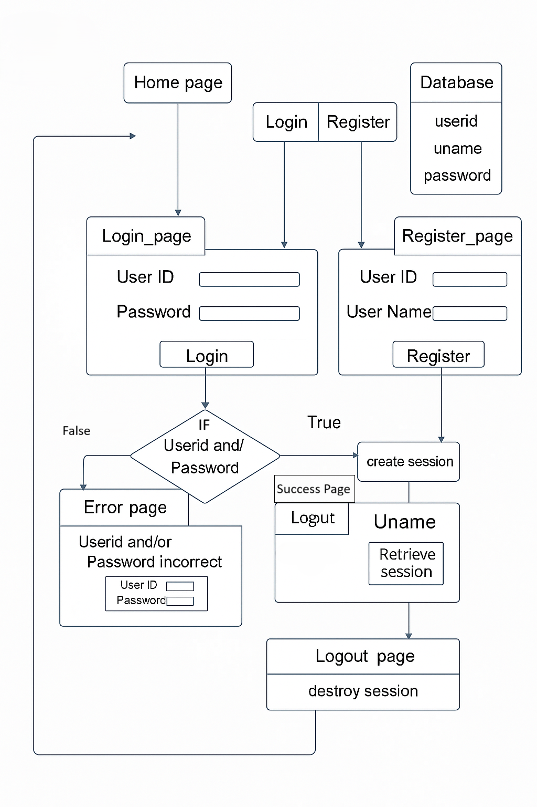
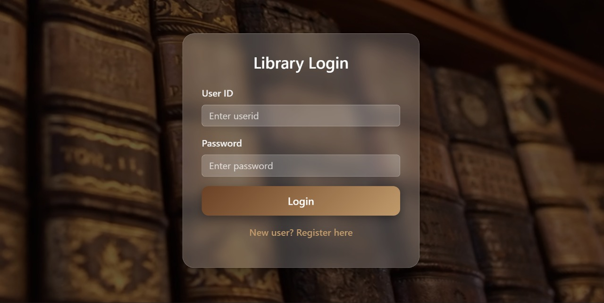
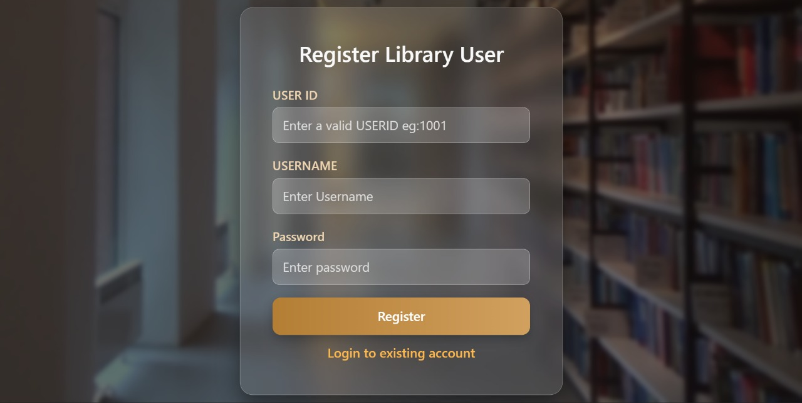
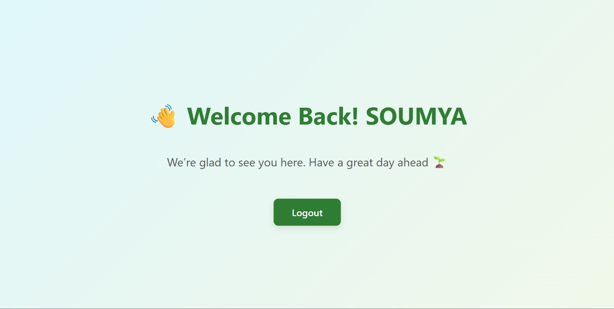

Project: JSP Login & Register (Session with Database)
=========================================

Overview
--------
This small JSP-only project demonstrates a simple login and registration flow using the implicit JSP session object and a relational database. The application uses JSP pages (no servlets) and stores user data in a database table. Sessions are created on successful login and destroyed on logout. The original hand-drawn DFD (Data Flow Diagram) has been digitized and is included as DFD_sketch.png.

Files (typical)
---------------
Place these files into your webapp (e.g., in the webapps/MyApp folder for Tomcat):
- login.jsp                      : Shows login form (user id, password).Also contains link to register page.
- register.jsp                   : Shows registration form (user id, username, password).Also contains link to login page.
- loginProcess.jsp               : (Optional) Processes login logic, validates against DB, creates session.
- registerProcess.jsp            : (Optional) Processes registration and inserts new user in DB.
- success.jsp                    : Logged-in landing page. Reads username from session.
- error.jsp                      : Shown when login fails or input invalid.
- logout.jsp                     : Destroys session and redirects to home/login.
- README.md                      : This file.

Database Schema
---------------
A simple users table will work. Example SQL (MySQL/oracleSQL):
```sql
CREATE TABLE users (
  userid VARCHAR(100) PRIMARY KEY,
  uname VARCHAR(150) NOT NULL,
  password VARCHAR(255) NOT NULL
);
```
Note: For real projects, always salt & hash passwords; never store plaintext passwords.

How it works (flow)
-------------------
1. User lands on the home page and chooses Login or Register.
2. Register: register.jsp collects new user details and inserts them into the database. On success, redirect to login.jsp.
3. Login: login.jsp collects credentials and checks DB. If successful:
   - Create a session: `session.setAttribute("userid", userid); session.setAttribute("uname", uname);`
   - Redirect to success.jsp which reads the session attributes to display "Welcome uname" and a Logout link.
4. Logout: logout.jsp invalidates the session: `session.invalidate();` and redirects to home/login.
5. If login fails, show error.jsp with a retry link back to login.jsp.

DFD:-
-----
<br>


Sample JSP snippets
-------------------
Login processing (pseudo-code in JSP scriptlet):
```jsp
<%-- loginProcess.jsp --%>
<%@ page import="java.sql.*" %>
<% 
String userid = request.getParameter("userid");
String password = request.getParameter("password");
// (Perform input validation)
// Connect to DB and check credentials
// Example: SELECT uname FROM users WHERE userid=? AND password=?
if (match) {
  session.setAttribute("userid", userid);
  session.setAttribute("uname", usernameFromDB);
  response.sendRedirect("success.jsp");
} else {
  request.setAttribute("error", "User id and/or password incorrect");
  request.getRequestDispatcher("error.jsp").forward(request, response);
}
%>
```

Logout (logout.jsp):
```jsp
<% 
session.invalidate();
response.sendRedirect("login.jsp");
%>
```

User Interface :-
<br>



<br>

Security notes 
-----------------------------
- Never use scriptlets and raw JDBC in production — prefer MVC, prepared statements, and proper separation (Servlets/DAO). Use JSTL and EL in views.
- Hash passwords with bcrypt or PBKDF2. Use prepared statements to avoid SQL injection.
- Use HTTPS for transport security.
- Consider HTTP-only secure cookies for session management and proper session timeout.

Deployment (quick)
------------------
1. Put the JSP files and optional config in a folder under Tomcat's webapps (e.g. `webapps/LoginApp/`).
2. Ensure your JDBC driver (MySQL/oracleSQL connector) is in Tomcat's lib folder or WEB-INF/lib.
3. Configure database (MySQL/oracleSQL) and update connection settings used by your JSP pages.
4. Start Tomcat server by running the login.jsp page as "Run on Tomcat serever".


